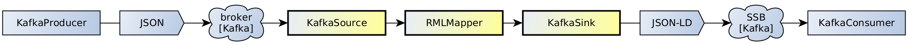

# SMASSIF-RML

A Semantic Web stream processing solution with declarative data mapping capability based on a modified version of the [RMLMapper-java](https://github.com/RMLio/rmlmapper-java) tool and extensions to the [StreamingMASSIF](https://github.com/IBCNServices/StreamingMASSIF) framework.

## Features

* [RDF](https://www.w3.org/RDF/) stream processing pipelines (based on the StreamingMASSIF framework)
  * [X] [RML](https://rml.io/specs/rml/) mapping on streams (based on evolved release of RMLMapper),
  * [X] [JSON-LD](https://json-ld.org/) data forwarding to a downstream [Kafka](https://kafka.apache.org/) topic,
  * [X] File-based configuration of the pipelines.  

* Demonstration pipelines
  * [X] Kafka producer of random data generator in JSON syntax,
  * [X] RML mapping,
  * [X] Kafka consumer for displaying mapped data in JSON-LD syntax,
  * [X] Automated run through GNU [make](http://www.gnu.org/software/make/manual/make.html).
    
## Quick-start

The following quick-start builds the project and starts the *demonstration* pipeline:

* Install external librairies: `make install-dependencies`
* Build modules: `mvn package` (rely on [Maven](https://maven.apache.org/) 3.6+)
* Start Kafka broker: `make start-kafka` (rely on the [bitnami/kafka](https://hub.docker.com/r/bitnami/kafka) Docker image)
* Start demo pipeline: `make demo-dsm`
* Observe mapping in CLI output
* Stop pipeline: `Ctrl-C`
* Stop Kafka broker: `make stop-kafka`

The demonstration pipeline is akin to:




Input sample from the `MyKafkaProducer` component:

```json
{
    "name": {
        "family_name": "Ondricka",
        "first_name": "Ewald"
    },
    "enemies": ["Casimer"],
    "id": 21,
    "friends": ["Amely"]
}
```

Output sample from the `MyKafkaConsumer` component (i.e. after RML mapping, JSON-LD syntax):

```json
[ {
  "@graph" : [ {
    "@id" : "http://example.com/person/21",
    "@type" : [ "http://xmlns.com/foaf/0.1/Person" ],
    "http://example.com/id" : [ {
      "@value" : "21"
    } ],
    "http://xmlns.com/foaf/0.1/familyName" : [ {
      "@value" : "Ondricka"
    } ],
    "http://xmlns.com/foaf/0.1/firstName" : [ {
      "@value" : "Ewald"
    } ],
    "http://xmlns.com/foaf/0.1/friend" : [ {
      "@value" : "Amely"
    } ]
  } ],
  "@id" : "http://example.com/base/myGraph1"
} ]
```

## Usage

We provide 3 modules to construct StreamingMASSIF RDF stream processing pipelines with RML mapping capabilities:

* **rmlmapper-for-streaming**: the well-known RMLMapper tool modified for handling data streams.
  See [rmlmapper-for-streaming/README](rmlmapper-for-streaming/README.md) for implementation details and re-engineering notes (i.e. *RMLMapper-java* vs *rmlmapper-for-streaming* comparison).

* **massif**: adhoc StreamingMASSIF components for building pipelines with the *rmlmapper-for-streaming* module and allowing forwarding data to a downstream Kafka broker.
  See [massif/README](massif/README.md) for implementation details and *directions for making your own pipeline!*

* **data-stream-manager** (dsm): implementation of StreamingMASSIF pipelines with external configuration reader, including RML mapping rule set.
  See [dsm/README](dsm/README.md) for implementation details, and browse the module's code for the *demonstration pipelines* used in the above *quick-start* section.
  
## Copyright

Copyright (c) 2022-2023, Orange. All rights reserved.

## License

[BSD-4](LICENSE.txt)

## Maintainer

* Mihary RANAIVOSON
* [Lionel TAILHARDAT](mailto:lionel.tailhardat@orange.com)
* [Perrine GUILLEMETTE](mailto:perrine.guillemette@orange.com)
* [Yoan CHABOT](mailto:yoan.chabot@orange.com)
* [Raphaël TRONCY](mailto:raphael.troncy@eurecom.fr)
