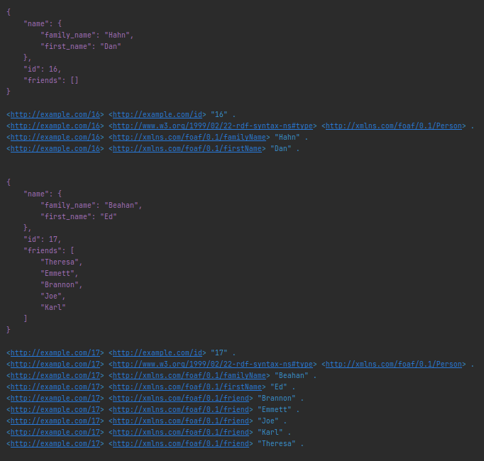
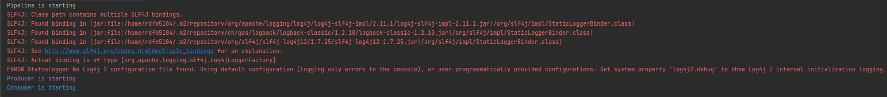

# SMASSIF-RML / data-stream-manager (dsm)

The **dsm** module holds `Pipelines` for manipulating data stream.  
The main class for defining these `Pipelines` comes from the **massif** module

## Usage

Defining pipelines basically corresponds to:

* Implementing a chain of processing components matching the [StreamingMASSIF](https://github.com/IBCNServices/StreamingMASSIF) framework requirements. Please refer to the StreamingMASSIF's documentation for more details about the framework constraints and embedded components.
* Running the pipeline, which corresponds to starting an infinite loop.

Examples:

* A *simple example* is provided in [src/test/java/com/orange/noria/dsm/Demo.java](src/test/java/com/orange/noria/dsm/Demo.java).
* In order to achieve more flexible use, we have set up a hierarchy of classes and the possibility to use a configuration file.
  The SMASSIF-RML's *quick-start* section showcases this approach based on the [com.orange.noria.dsm.mains.Main1Test](src/main/java/com/orange/noria/dsm/mains/Main1Test.java) class.
  With further details, it gets it running parameters (e.g. Kafka broker address, RML file path) from a [config.ini](src/main/resources/config.ini) file, then instantiates and runs a specialization of the `MainBase` class.

We also provide helper components for quick prototyping with a Semantic Service Bus (SSB) architecture approach:

* [com.orange.noria.dsm.components.MyKafkaProducer](src/main/java/com/orange/noria/dsm/components/MyKafkaProducer.java): a Kafka producer with random data generator in JSON syntax
* [com.orange.noria.dsm.components.MyKafkaConsumer](src/main/java/com/orange/noria/dsm/components/MyKafkaConsumer.java): a Kafka consumer displaying JSON data to stdout.

Running the *com.orange.noria.dsm.mains.Main1Test* example typically produces the following CLI output:

  

Additional remarks for the the *com.orange.noria.dsm.mains.Main1Test* example:

- The RML rules are located in [src/main/resources/](src/main/resources/). 

- The pipeline takes time to be lauched. As a consequence:
  - at the beginning only data sent by the producer are displayed,
  - then, data sent (by the producer) and data received (by the consumer) are both displayed.

- The following error message may appear but is not critical (i.e the programm is still running):

  
