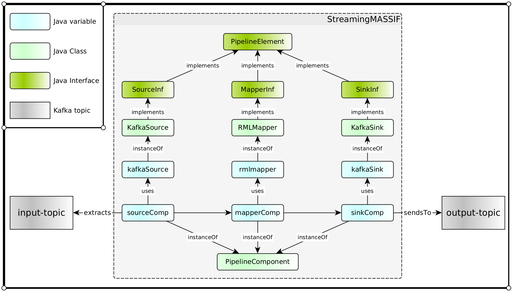

# SMASSIF-RML / StreamingMASSIF-with-rmlmapper (massif)

The **massif** module extends the [StreamingMASSIF](https://github.com/IBCNServices/StreamingMASSIF) framework with the following *pipelineElements*:

- *RMLMapper*
- *KafkaSink*

Class details and a pipeline implementation example are provided below.

## RMLMapper

* **Class**: RMLMapper
* **Package**: com.orange.noria.massif.mapping
* **Function**: Maps the data stream using RML rules
* **Constructor**:

  ```java
  public RMLMapper(String mappingFilePath, String outputFormat, String triplesMaps_str)
  ```

* **Arguments**:
  
  | Argument | Role | Remark |
  |---|---|---|
  | `mappingFilePath` | Path to the RML rules file | Example: `./src/main/resources/rml-1.ttl` |
  | `outputFormat` | Serialization format | Possible values: `nquads`, `turtle`, `trig`, `trix`, `jsonld`, `hdt`
  | `triplesMaps_str` | Ordered list of `rr:TriplesMap` IRIs to run | Separator: `,`. Default (empty string): all triplesmaps |

* **Remarks**:
  * Relies on the `be.ugent.rml.main.JSONRecordMapper` class provided by the SMASSIF-RML/rmlmapper-for-streaming module. Declare the following dependency in your app's `pom.xml`:

    ```xml
    <dependency>
      <groupId>com.orange.noria</groupId>
      <version>${project.version}</version>
      <artifactId>rmlmapper-for-streaming</artifactId>
    </dependency>
    ```


## KafkaSink

* **Class**: KafkaSink
* **Package**: com.orange.noria.massif.sinks
* **Function**: Sends the data stream to a Kafka topic
* **Constructor**:

  ```java
  public KafkaSink(String kafkaServer, String kafkaTopic)
  ```

* **Arguments**:

  | Argument | Role | Remark |
  |---|---|---|
  | `kafkaServer` | Address of the kafka server | Example: `127.0.0.1:9092` |
  | `kafkaTopic` | Kafka topic where data are sent | Example: `output-topic-1` |

* **Remarks**: none.

## Pipeline Example

Based on above components, you can build a StreamingMASSIF pipeline as follows:

```java
public class EMS
{
    private static String kafkaServer = "127.0.0.1:9092";
    private static String inputTopic = "input-topic";
    private static String outputTopic = "output-topic";
    private static String mappingFilePath = "./path/to/my/rules.ttl";
    private static String outputFormat = "jsonld";
    private static String triplesMaps = "";
    
    public static void main(String[] args) throws Exception
    {
        // All PipeLineElements
        KafkaSource kafkaSource = new KafkaSource(EMS.kafkaServer, EMS.inputTopic);
        RMLMapper rmlMapper = new RMLMapper(EMS.mappingFilePath, EMS.outputFormat, EMS.triplesMaps);
        KafkaSink kafkaSink = new KafkaSink(EMS.kafkaServer, EMS.outputTopic);
        
        // All PipeLineComponents
        PipeLineComponent sinkComp = new PipeLineComponent(kafkaSink, Collections.EMPTY_LIST);
        PipeLineComponent mapperComp = new PipeLineComponent(rmlMapper, Collections.singletonList(sinkComp));
        PipeLineComponent sourceComp = new PipeLineComponent(kafkaSource, Collections.singletonList(mapperComp));

        // Run
        kafkaSource.stream();
    }
}
```

The code above summarizes as follows:



