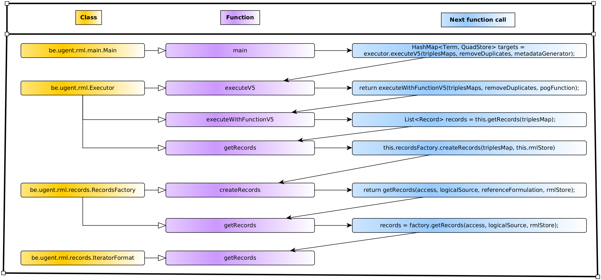

# SMASSIF-RML / rmlmapper-for-streaming

The **rmlmapper-for-streaming** module is a reworked fork of the [rmlmapper-java](https://github.com/RMLio/rmlmapper-java) project for making it handling data streams.
Major changes relate to the *rmlmapper-java* input/output handling approach and the class hierarchy.
Differences are summarized in the following table, and explained with greater details in the below *[re-engineering notes](#re-engineering-notes)* section.

|            |                           **initial rmlmapper-java project**                            |               **this module** |
|:----------:|:------------------------------------------------------------------------:|:--------------------------------------------:|
| **input**  | data to map are in a file (this file is accessible by reading RML rules) | data to map are in input of the map function |
| **output** |                data mapped are written in a file                         |    data mapped are contained in a string     |


## JSONRecordMapper Class

* **Class**: JSONRecordMapper ([implementation](src/main/java/be/ugent/rml/main/JSONRecordMapper.java))
* **Package**: be.ugent.rml.main
* **Function**: Maps the data stream using RML rules
* **Constructor**:

  ```java
  public JSONRecordMapper(String mappingFilePath, String outputFormat, String triplesMaps_str)
  ```

* **Arguments**:

  | Argument | Role | Remark |   
  |---|---|---|
  | `mappingFilePath` | Path to the RML rules file | Example: `./src/main/resources/rml-1.ttl` |
  | `outputFormat` | Serialization format | Possible values: `nquads`, `turtle`, `trig`, `trix`, `jsonld`, `hdt`
  | `triplesMaps_str` | Ordered list of `rr:TriplesMap` IRIs to run | Separator: `,`. Default (empty string): all triplesmaps |

* **Remarks**:
  * The class implements the `map` method
  
    ```java
    public String map(String record_str)
    ```

    - **Input**: Stringified JSON object with data to map
    - **Output**: Mapped data
  
## Usage example

* **Data units** to map are JSON structures:

  ```json
  {
      "id": "Alice",
      "name": {
          "first_name": "Alice",
          "family_name": "Agougrou"
      },
      "friends": [ "Bob", "Carl" ],
      "enemies": [ "Eve", "Fanny" ]
  }
  ```

  (see [SMASSIF-RML/demo/data.json](../demo/data.json) for a longer file-based example as a JSON list).

* **Mapping rules** are implemented in files, in [RDF Turtle](https://www.w3.org/TR/turtle/) syntax and based on the [RML](https://rml.io/specs/rml/) data model:

  ```
  @prefix rr: <http://www.w3.org/ns/r2rml#> .
  @prefix rml: <http://semweb.mmlab.be/ns/rml#> .
  @prefix ql: <http://semweb.mmlab.be/ns/ql#> .
  @base <http://noria.orange.com/example/> .
  
  <TriplesMap1>
    a rr:TriplesMap;
    rml:logicalSource [
        rml:source "./test/data.json";
        rml:referenceFormulation ql:JSONPath;
        rml:iterator "$";
    ];
  
    rr:subjectMap [
        rr:template "http://noria.orange.com/example/{id}";
        rr:class foaf:Person
    ];
  
    rr:predicateObjectMap [
        rr:predicate ex:id ;
        rr:objectMap [ rml:reference "id" ]
    ];
  ```

  (see [SMASSIF-RML/demo/rmlmapper-rml-demo.ttl](../demo/rmlmapper-rml-demo.ttl) for the complete example).

* **Running** the solution can be done from,
  * CLI:
    ```shell
    JAR_PATH="path/to/the/xxx.jar" # path to this jar
    RECORD="{ \"id\": \"Alice\", \"name\": { \"first_name\": \"Alice\", \"family_name\": \"Agougrou\" }, \"friends\": [ \"Bob\", \"Carl\" ], \"enemies\": [ \"Eve\", \"Fanny\" ] }"
    MAPPING_PATH="path/to/the/mapping//file/xxx.ttl"
    TRIPLEMAPS=""
    SERIALIZATION="turtle"
    
    echo -e "\n\n-------"
    java -jar "${JAR_PATH}" \
        -r "${RECORD}" \
        -m "${MAPPING_PATH}" \
        -s "${SERIALIZATION}"
    echo -e "-------\n\n"
    ```

  * As a library: see the [ToyExample.java](src/main/java/be/ugent/rml/main/ToyExample.java) snippet.

* **Mapped data** is returned in the shell's standard out:
  ````
  <http://example.com/Alice> a <http://xmlns.com/foaf/0.1/Person>;
    <http://example.com/id> "Alice";
    <http://xmlns.com/foaf/0.1/familyName> "Agougrou";
    <http://xmlns.com/foaf/0.1/firstName> "Alice";
    <http://xmlns.com/foaf/0.1/friend> "Bob", "Carl" .
  ````

## Re-engineering notes

The following re-engineering notes compares *RMLio/rmlmapper-java* to *SMASSIF-RML/rmlmapper*:

- **Renaming packages**
  - **Where**: `src/main/java`
  - **Before**: `be.ugent.rml.cli`
  - **Now**: `be.ugent.rml.main`

- **Modification totale de l'input en command line**
  - **Where**: `src/main/java/be/ugent/rml/main`
  - **Before**:
    - Many options
    - Input data stored in files
    - Path to input data is defined in the RML mapping rules set
  - **Now**:
    - Less options
    - Input data is a string with JSON structure
    - Input data is fed through the standard input (stdin).
  - **Consequences**: Since the data to be mapped is placed as an argument, this argument must be passed to each child function (see item *propagation of an argument*).

- **Modification de l'output**
  - **Where**: `src/main/java/be/ugent/rml/main`
  - **Before**: output data is stored in a file
  - **Now**:
    - Output displayed on the console (if execution is launched from the `Main` class).
    - Output written to a string (if execution is launched from the `JSONRecordMapper` class).

- **Introduction d'une classe intermédiaire**
  - **Where**: `src/main/java/be/ugent/rml/main`
  - **Intermediary class**: `JSONRecordMapper`
  - **Before**:
    1. `main` method of the `Main` class parses the arguments.
    2. `main` method calls the `executorV5` method (of the `be.ugent.rml.Executor` class).
      - This method is crucial for the mapping.
      - This method calls many other methods, which in turn call many other methods.
    3. The `main` method of the `Main` class writes the results to a file.
  - **Now**:

    1. `main` method of the `Main` class parses the arguments.
    2. `main` method calls the `map` method (of the `be.ugent.rml.JSONRecordMapper` class).
    3. `map` method calls the `executorV5` method (of the `be.ugent.rml.Executor` class). The `executorV5` method is the same as before (with the exception of adding an argument...).
    4. `map` method returns a string containing the mapped data.
    5. `main` method displays the mapped data.
  - **Explanation**: The introduction of an intermediate class facilitates the use of this project by another Java project, i.e. another Java project will import this intermediate class.

- **Propagation d'un argument**
  - **Where**: see below *code_before_modif* diagram.
  - **Description**: the `String record_str` argument is propagated to several child functions of the `main` function (of the `Main` class). This argument corresponds to the data to be mapped.



Remarks:

* The above diagram represents the code before modification.
* Only the classes that will have a modification are shown.
* The code after modification is the same, with the addition that:
  * The `be.ugent.rml.JSONRecordMapper` class is introduced between the `Main` class and the `Executor` class.
  * Each of these functions has the `record_str` argument in addition.